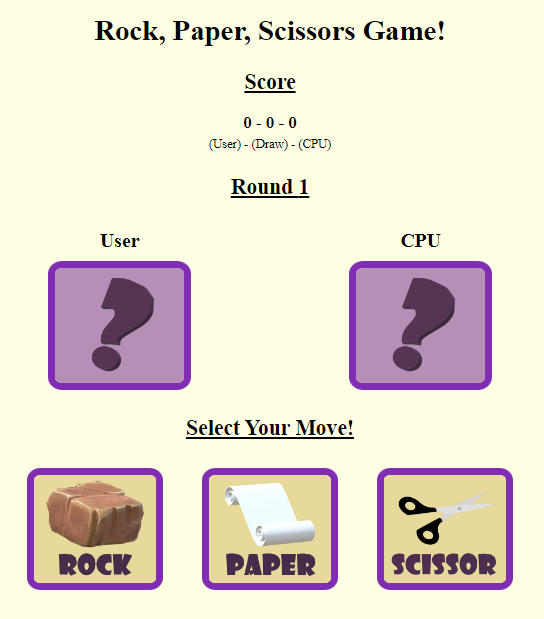

# Rock-Paper-Scissors Game

A rock-paper-scissors game built with HTML, CSS, and JavaScript.

The game can be accessed [here](https://tkaatz.github.io/Rock_Paper_Scissors_Game/).

# Summary
This project is a implementation of the classic game Rock-Paper-Scissors, built with HTML, CSS, and JavaScript. The user can select one of the three options (rock, paper, or scissors) by clicking on the corresponding image, and then confirm their choice by clicking a "Confirm Move" button. The computer's choice is randomly generated, and the result (Victory!, Defeat, or Draw) is displayed along with the score. The user can play again by clicking a "Play Again?" button, which resets the game but keeps the score.

The project uses basic HTML tags (such as 
, , <button>, and ) to structure the page and display the content. The CSS file provides some styling to make the game more visually appealing, including a background color, images with rounded borders for the game options, and a scoreboard. The JavaScript file handles the logic of the game, including the user's and computer's choices, the comparison of the choices, the update of the score, and the animation of the Rock-Paper-Scissors-Show! countdown.

Overall, this project is a good exercise for beginners who want to practice their HTML, CSS, and JavaScript skills, and learn about basic game programming concepts such as random generation, event handling, and conditional statements. It can be extended with additional features (such as sound effects, a history of results, or multiplayer mode) to make it more challenging and fun.

# Author
**Taylor Kaatz** - [Linkedin](https://www.linkedin.com/in/taylor-kaatz-9488b149/)